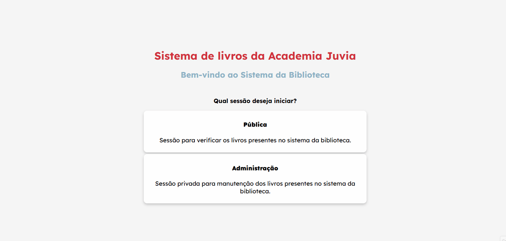
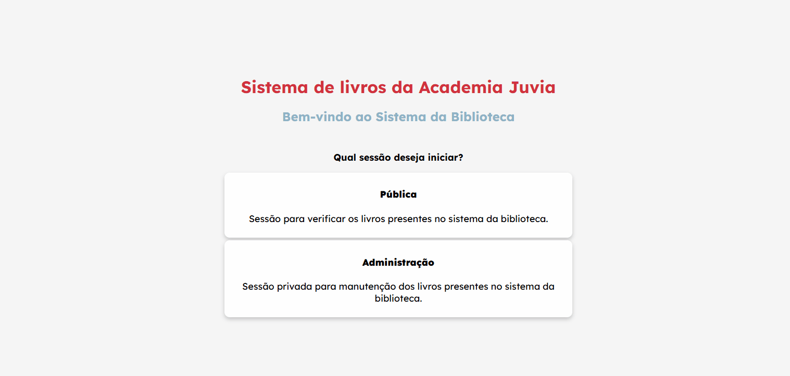
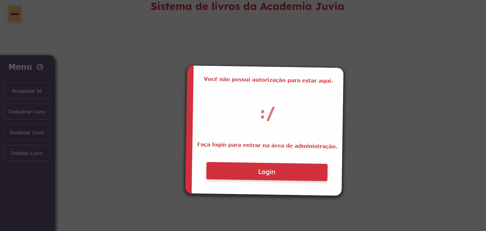
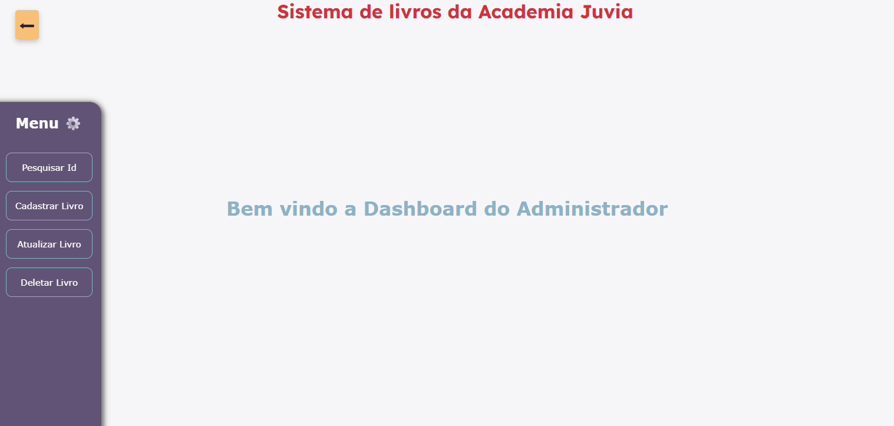

# Sistema de Biblioteca – API e Front-end


---

[](LICENSE)


Este é um sistema de gerenciamento de biblioteca desenvolvido em **.NET 10**  e **Entity Framework Core**, utilizando **SQL Server** como banco de dados. O sistema oferece uma interface web pública para consulta de livros e uma área administrativa protegida por autenticação JWT para operações de CRUD (criar, atualizar, deletar) no acervo.

O projeto foi desenvolvido com fins de aprendizado e portfólio, e o código está disponível publicamente para estudo e referência.

## Tecnologias Utilizadas

- **.NET 10 (C#)** – Framework principal
- **ASP.NET Core** – Criação da API e middlewares
- **Entity Framework Core** – ORM para acesso ao banco de dados
- **SQL Server** – Banco de dados relacional
- **JWT (Json Web Token)** – Autenticação de usuários administradores
- **HTML5, CSS3, JavaScript (vanilla)** – Interface do usuário servida como arquivos estáticos

## Pré‑requisitos

- [.NET 10 SDK](https://dotnet.microsoft.com/download/dotnet/10.0)
- [SQL Server](https://www.microsoft.com/pt-br/sql-server/sql-server-downloads) (ou SQL Server Express)
- Uma ferramenta para testar a API (opcional): [Insomnia](https://insomnia.rest/), [Postman](https://www.postman.com/)

## Instalação e Execução

1. **Clone o repositório:**
   ```bash
   git clone https://github.com/rallantro/sistema-biblioteca.git

2. **[Configure o Banco de Dados](#configuração-do-banco-de-dados)**
   
3. **Rode a aplicação:**
   ```bash
   dotnet watch run

## Estrutura de Pastas do Projeto

A organização do projeto segue o padrão comum do ASP.NET Core, com separação clara entre camadas e responsabilidades. Abaixo está a descrição das principais pastas e arquivos:

```
Sistema-de-Biblioteca---C-/
│
├── Controllers/               # Controladores da API
│   ├── LivrosController.cs    # Endpoints relacionados a livros
│   └── UserController.cs      # Endpoints de autenticação e usuários
│
├── Models/                     # Classes que representam os dados
│   ├── Livro.cs                # Modelo de Livro
│   ├── User.cs                 # Modelo de Usuário
│   ├── LoginRequest.cs         # DTO para requisição de login
│   └── Key.cs                  # Chave secreta para JWT (apenas exemplo)
│
├── Context/                     # Contexto do Entity Framework
│   └── BiblioContext.cs         # DbContext para acesso ao banco de dados
│
├── Services/                     # Serviços auxiliares
│   └── TokenService.cs           # Geração de tokens JWT
│
├── Migrations/                   # Migrations do Entity Framework (geradas automaticamente)
│
├── wwwroot/                       # Arquivos estáticos (front-end)
│   ├── index.html                 # Página inicial
│   ├── public.html                # Área pública
│   ├── login.html                 # Página de login
│   ├── admin.html                 # Painel administrativo
│   ├── style.css                  # Estilos globais
│   ├── public.js                  # Lógica da área pública
│   ├── login.js                   # Lógica de login
│   ├── admin.js                   # Lógica do painel admin
│
├── Properties/                    # Configurações de launch (launchSettings.json)
│
├── appsettings.json                # Configurações gerais (string de conexão, etc.)
├── appsettings.Development.json    # Configurações para desenvolvimento
├── Program.cs                      # Ponto de entrada e configuração da aplicação
├── Sistema de Biblioteca - C#.csproj  # Arquivo de projeto
```

### Descrição das pastas principais

- **Controllers**: Responsáveis por receber as requisições HTTP, processá-las (com auxílio dos Models e do Context) e retornar as respostas adequadas.
- **Models**: Contêm as classes que representam as entidades do domínio (Livro, User) e também objetos de transferência de dados (loginRequest). A classe `Key` armazena a chave secreta para assinatura do JWT (apenas para fins didáticos).
- **Context**: Abriga o `DbContext` do Entity Framework, que mapeia as classes de modelo para as tabelas do banco de dados.
- **Services**: Classes com lógica reutilizável, como a geração de tokens JWT.
- **Migrations**: Pasta gerada automaticamente pelo Entity Framework para versionamento do esquema do banco de dados.
- **wwwroot**: Diretório raiz para arquivos estáticos. Todo o front-end (HTML, CSS, JavaScript) fica aqui, permitindo que sejam servidos diretamente pelo servidor web. A estrutura dentro de wwwroot é organizada por funcionalidade.


## Configuração do Banco de Dados

1. **Context:** O arquivo `BiblioContext.cs` já possui as configurações necessárias para criar as tabelas dentro do SQL Server através do **Entity Framework Core**. Caso necessário, você pode adicionar novos `DbSet<>` para incluir outros modelos.

2. **Configure a string de conexão:** No arquivo `appsettings.json` ou `appsettings.Development.json` (dependendo do ambiente), defina a conexão com o SQL Server:

   ```json
   {
     "ConnectionStrings": {
       "ConexaoPadrao": "Server=SEU_SERVIDOR;Database=BibliotecaDB;Integrated Security=True;TrustServerCertificate=True;"
     }
   }
   ```
   Substitua `SEU_SERVIDOR` pelo nome da sua instância do SQL Server (por exemplo, `(localdb)\\MSSQLLocalDB` para o LocalDB, ou `localhost`).

3. **Crie as migrações e atualize o banco de dados:**  
   Execute os comandos abaixo no terminal, dentro da pasta do projeto, para gerar a migração inicial e aplicar as alterações no banco:

   ```bash
   dotnet ef migrations add InitialCreate
   dotnet ef database update
   ```

   > **Nota:** Certifique-se de ter as ferramentas do Entity Framework Core instaladas globalmente (`dotnet tool install --global dotnet-ef`) ou utilize a versão local via `dotnet ef`.
   > 
## Criando um Usuário Administrador

O sistema não possui uma rota pública para cadastro de usuários, por padrão, apenas um administrador deve ser inserido diretamente no banco de dados. Isso garante que o acesso à área administrativa seja controlado manualmente. Porém, isso não impede a criação de mais usuários.

1. **Abra o SQL Server Management Studio (ou outra ferramenta) e conecte-se ao banco `BibliotecaDB`.**
2. **Execute o seguinte comando INSERT para criar um usuário administrador:**

   ```sql
   INSERT INTO Users (UserName, Password)
   VALUES ('admin', '123456');
   ```

   > **Observação:**  
   > - A tabela `Users` será criada automaticamente após as migrações.  
   > - O campo `Id` é auto-incremento, portanto não precisa ser informado.  
   > - Para este projeto de exemplo, a senha é armazenada em texto puro (sem hash), pois o foco é a demonstração das funcionalidades, o ideal é implementar BCrypt para hashing de senhas para melhorar a segurança.
   > - Você pode alterar o nome de usuário e senha conforme preferir.
---

Se desejar, pode inserir mais usuários da mesma forma, mas lembre-se de que todos terão os mesmos privilégios (não há níveis de acesso diferenciados).

##  Sistema de Autenticação

O projeto utiliza **JWT (JSON Web Token)** para autenticação e autorização. Apenas usuários autenticados podem acessar as rotas de cadastro, atualização e exclusão de livros. 

### 1. Geração do Token (Login)

Quando o usuário envia suas credenciais para a rota `/User/login`, o sistema valida os dados e, se corretos, gera um token JWT contendo o identificador do usuário.

O `UserController.cs`, possui a função de verificar na base de dados se o `loginRequest` entregue pelo usuário se equivale a algum usuário na tabela e então chama a função `GerarToken()`:

```csharp
[HttpPost("login")]
public IActionResult Login([FromBody] loginRequest _user)
{
    var user1 = _context.users.FirstOrDefault(x => x.userName == _user.loginUser && x.password == _user.loginPass);
    if (user1 != null)
    {
        var token1 = TokenService.GerarToken(user1);
        return Ok(token1);   
    }
    return Unauthorized();
}
```


Essa função está presente em `TokenService.cs`, a qual configura o token JTW que será utilizado para a autenticação e autorização do usuário nas funções administrativas:
```csharp
public class TokenService
{
    public static object GerarToken(User user)
    {
        var key = Encoding.UTF8.GetBytes(Key.keyToken);
        var tokenConfig = new SecurityTokenDescriptor
        {
            Subject = new ClaimsIdentity(new Claim[]
            {
                new Claim("userID", user.id.ToString())
            }),
            Expires = DateTime.UtcNow.AddHours(9),
            SigningCredentials = new SigningCredentials(new SymmetricSecurityKey(key), SecurityAlgorithms.HmacSha256)
        };

        var tokenHandler = new JwtSecurityTokenHandler();
        var token = tokenHandler.CreateToken(tokenConfig);
        var tokenString = tokenHandler.WriteToken(token);
        return new { token = tokenString };
    }
}
```

- A chave secreta (`Key.keyToken`) está definida em `Key.cs` (apenas para fins de exemplo, o ideal é usar variáveis de ambiente ou user-secrets para armazenar a chave).
- O token expira após 9 horas e carrega apenas o `userID` como *claim*.

### 2. Configuração da Autenticação (Program.cs)

No arquivo `Program.cs`, o serviço de autenticação JWT é registrado com os parâmetros necessários:

```csharp
var key = Encoding.UTF8.GetBytes(Key.keyToken);

builder.Services.AddAuthentication(x =>
{
    x.DefaultAuthenticateScheme = JwtBearerDefaults.AuthenticationScheme;
    x.DefaultChallengeScheme = JwtBearerDefaults.AuthenticationScheme;
}).AddJwtBearer(x =>
{
    x.RequireHttpsMetadata = false; // apenas para desenvolvimento
    x.SaveToken = false;
    x.TokenValidationParameters = new TokenValidationParameters
    {
        ValidateIssuerSigningKey = true,
        IssuerSigningKey = new SymmetricSecurityKey(key),
        ValidAlgorithms = new[] { SecurityAlgorithms.HmacSha256 },
        ValidateIssuer = false,
        ValidateAudience = false
    };
    // Eventos para depuração (opcionais)
    x.Events = new JwtBearerEvents
    {
        OnAuthenticationFailed = context =>
        {
            Console.WriteLine($"[JWT] Falha: {context.Exception.Message}");
            return Task.CompletedTask;
        },
        OnTokenValidated = context =>
        {
            Console.WriteLine("[JWT] Token validado com sucesso");
            return Task.CompletedTask;
        }
    };
});
```

- A chave simétrica é usada para assinar e validar o token.
- Em produção, recomenda-se habilitar `RequireHttpsMetadata = true` e configurar `ValidateIssuer`/`ValidateAudience`.

### 3. Proteção das Rotas com `[Authorize]`

Os endpoints que exigem autenticação são marcados com o atributo `[Authorize]`. Por exemplo, no `LivrosController`:

```csharp

[Authorize]
[HttpGet("porId/{id}")]
public IActionResult ObterID(int id)
{
	// ...
}

[Authorize]
[HttpPost]
public IActionResult cadastrarLivro([FromBody] Livro livroNovo)
{
    // ...
}

[Authorize]
[HttpPut]
public IActionResult atualizarlivro([FromBody] Livro livroNovo)
{
    // ...
}

[Authorize]
[HttpDelete("{id}")]
public IActionResult delete(int id)
{
    // ...
}
```

Além disso, o `UserController` possui um endpoint que serve apenas para verificar se o token é válido:

```csharp
[Authorize]
[HttpPost]
public IActionResult verifyLogin()
{
    return Ok();
}
```

### 4. Integração com o Front‑end

O token gerado no login é armazenado no `localStorage` do navegador e enviado no cabeçalho `Authorization` das requisições para as rotas protegidas.

**Exemplo (admin.js):**
```javascript
const token = localStorage.getItem("token");

fetch('/Livros', {
    method: 'POST',
    headers: {
        'Content-Type': 'application/json',
        "Authorization": `Bearer ${token}`
    },
    body: JSON.stringify(novoLivro)
})
```

### 5. Fluxo Resumido

1. Usuário envia `loginUser` e `loginPass` para `/User/login`.
2. Servidor valida as credenciais no banco de dados.
3. Se válidas, gera um token JWT e o retorna.
4. O front‑end armazena o token e o envia em requisições subsequentes.
5. O middleware de autenticação valida o token automaticamente.
6. Rotas com `[Authorize]` só são executadas se o token for válido.

---

**Importante:** A senha é armazenada em texto puro neste projeto, pois o objetivo é facilitar a compreensão do código em um ambiente de portfólio. Em aplicações reais, utilize hash com algoritmos seguros (como BCrypt ou PBKDF2).


## Endpoints da API

Abaixo estão todos os endpoints disponíveis, separados entre públicos (acessíveis sem autenticação) e administrativos (requerem token JWT no cabeçalho `Authorization`).

---

### Endpoints Públicos

#### `POST /User/login`
- **Descrição:** Realiza a autenticação do usuário e retorna um token JWT.
- **Corpo da requisição (JSON):**
  ```json
  {
    "loginUser": "admin",
    "loginPass": "123456"
  }
  ```
- **Resposta de sucesso (200 OK):**
  ```json
  {
    "token": "eyJhbGciOiJIUzI1NiIsInR5cCI6IkpXVCJ9..."
  }
  ```
- **Resposta de erro (401 Unauthorized):** Credenciais inválidas.

---

#### `GET /Livros/nome/{nome}`
- **Descrição:** Busca livros cujo título contenha o termo informado (case insensitive, por ser SQL Server).  Retorna uma lista de livros em ordem alfabética dos títulos.
- **Parâmetro de rota:** `nome` – termo a ser pesquisado.
- **Exemplo de requisição:** `GET /Livros/nome/harry`
- **Resposta de sucesso (200 OK):**
  ```json
  [
    {
      "Id": 1,
      "Nome": "Harry Potter e a Pedra Filosofal",
      "Descricao": "Primeiro livro da série",
      "Autor": "J.K. Rowling"
    },
    {
      "Id": 2,
      "Nome": "Harry Potter e a Câmara Secreta",
      "Descricao": "Segundo livro da série",
      "Autor": "J.K. Rowling"
    }
  ]
  ```
- **Resposta de erro (404 Not Found):** Nenhum livro encontrado.

---

#### `GET /Livros/autor/{nomeAutor}`
- **Descrição:** Busca livros cujo nome do autor contenha o termo informado (case insensitive por ser SQL Server). Retorna uma lista de livros em ordem alfabética dos títulos.
- **Parâmetro de rota:** `nomeAutor` – nome do autor.
- **Exemplo de requisição:** `GET /Livros/autor/rowling`
- **Resposta de sucesso (200 OK):** (mesmo formato do endpoint anterior)
- **Resposta de erro (404 Not Found):** Nenhum livro encontrado.

---

#### `GET /Livros/id/{nome}`
- **Descrição:** Retorna os IDs dos livros que possuem o título informado (útil para localizar o ID antes de operações de exclusão/atualização). Retorna uma lista de livros com seus respectivos IDs, em ordem alfabética.
- **Parâmetro de rota:** `nome` – título do livro.
- **Exemplo de requisição:** `GET /Livros/id/harry`
- **Resposta de sucesso (200 OK):** (mesmo formato dos anteriores, incluindo o ID)
- **Resposta de erro (404 Not Found):** Nenhum livro encontrado.

---

### Endpoints Administrativos (requerem token JWT)

Todas as rotas abaixo necessitam do cabeçalho `Authorization: Bearer {token}`. O token é obtido no endpoint de login.

#### `GET /Livros/porId/{id}`
- **Descrição:** Retorna os dados completos de um livro específico, identificado pelo seu ID.
- **Parâmetro de rota:** `id` – número inteiro do ID.
- **Exemplo de requisição:** `GET /Livros/porId/1`
- **Resposta de sucesso (200 OK):**
  ```json
  {
    "Id": 1,
    "Nome": "Harry Potter e a Pedra Filosofal",
    "Descricao": "Primeiro livro da série",
    "Autor": "J.K. Rowling"
  }
  ```
- **Resposta de erro (404 Not Found):** ID não encontrado.

---

#### `POST /Livros`
- **Descrição:** Cadastra um novo livro no sistema.
- **Corpo da requisição (JSON):**
  ```json
  {
    "Nome": "Em nome da Rosa",
    "Descricao": "Um monge franciscano investiga uma série de assassinatos em um remoto mosteiro italiano.",
    "Autor": "Umberto Eco"
  }
  ```
- **Resposta de sucesso (200 OK):** Sem corpo.
- **Resposta de erro (409 Conflict):** Já existe um livro com o mesmo nome (ignorando espaços em branco no início/fim).
- **Observação:** O campo `Id` não deve ser enviado, pois é gerado automaticamente.

---

#### `PUT /Livros`
- **Descrição:** Atualiza os dados de um livro existente.
- **Corpo da requisição (JSON):** Deve conter o ID do livro a ser alterado e os novos valores.
  ```json
  {
    "Id": 5,
    "Nome": "O Nome do Vento - Edição Especial",
    "Descricao": "Primeiro dia da crônica do assassino do rei (capa dura)",
    "Autor": "Patrick Rothfuss"
  }
  ```
- **Resposta de sucesso (200 OK):** Sem corpo.
- **Resposta de erro (404 Not Found):** ID não encontrado.

---

#### `DELETE /Livros/{id}`
- **Descrição:** Remove um livro do banco de dados.
- **Parâmetro de rota:** `id` – ID do livro a ser excluído.
- **Exemplo de requisição:** `DELETE /Livros/5`
- **Resposta de sucesso (204 No Content):** Sem corpo.
- **Resposta de erro (404 Not Found):** ID não encontrado.

---

#### `POST /User` (Verificação de token)
- **Descrição:** Endpoint auxiliar para verificar se o token é válido. Pode ser usado no front‑end para validar a sessão.
- **Cabeçalho:** `Authorization: Bearer {token}`
- **Resposta de sucesso (200 OK):** Sem corpo.
- **Resposta de erro (401 Unauthorized):** Token inválido ou ausente.

---

### Observações sobre os modelos de dados

- **Livro:**
  - `Id` (int) – identificador único, gerado pelo banco.
  - `Nome` (string) – título do livro.
  - `Descricao` (string) – descrição ou sinopse.
  - `Autor` (string) – nome do autor.

- **User:**
  - `UserId` (int) – identificador único.
  - `userName` (string) – nome de usuário para login.
  - `password` (string) – senha (em texto puro, apenas para demonstração).

Os nomes das propriedades no JSON devem respeitar a capitalização definida nos atributos `JsonPropertyName` dos modelos (ex.: `"Nome"` e não `"nome"`).

## Front-end: Estrutura e Funcionalidades

O front-end foi desenvolvido com **HTML5**, **CSS3** e **JavaScript puro**, seguindo uma abordagem de múltiplas páginas (MPA – Multiple Page Application). Cada página tem uma responsabilidade bem definida, e a comunicação com a API é feita através da API nativa do JavaScript, Fetch, utilizando JSON para o tráfego de dados.

### Estrutura de Páginas

O sistema é composto por quatro páginas principais:

| Página       | Arquivo         | Descrição                                                                 |
|--------------|-----------------|---------------------------------------------------------------------------|
| **Inicial**  | `index.html`    | Página de boas‑vindas que apresenta as duas áreas do sistema: pública e administrativa. |
| **Pública**  | `public.html`   | Permite consultar o acervo de livros por título ou autor, sem necessidade de autenticação. |
| **Login**    | `login.html`    | Formulário para autenticação do administrador.                           |
| **Admin**    | `admin.html`    | Painel de administração (restrito) onde é possível cadastrar, atualizar, pesquisar por ID e excluir livros. |

Cada página HTML possui um arquivo JavaScript correspondente (`public.js`, `login.js`, `admin.js`) que contém toda a lógica de interação com a API e manipulação do DOM.

---

### Página Inicial (`index.html`)

A página inicial é simples e objetiva: apresenta duas opções ao usuário – acesso à área pública ou à área de administração. O estilo utiliza cards com efeito hover para melhorar a experiência visual.

**Demonstração Visual:**


**Destaques do código:**
```html
<div class="menu">
    <p><b>Qual sessão deseja iniciar?</b></p>
    <div style="display: grid; gap: 5px;">
        <a class="card" href="public.html">
            <h4><b>Pública</b></h4> 
            <p>Sessão para verificar os livros presentes no sistema da biblioteca.</p>
        </a>
        <a class="card" href="login.html">
            <h4><b>Administração</b></h4> 
            <p>Sessão privada para manutenção dos livros presentes no sistema da biblioteca.</p>
        </a>
    </div>
</div>
```

Não há JavaScript associado a esta página, apenas navegação por links.

---

### Área Pública (`public.html` e `public.js`)

A página pública oferece uma interface de pesquisa que permite ao usuário buscar livros por **título** ou por **autor**. Os resultados são exibidos dinamicamente em cards.

#### Funcionalidades principais:

1. **Dropdown de seleção:** O usuário escolhe o tipo de pesquisa (Título ou Autor). O placeholder do campo de texto se adapta conforme a escolha.
2. **Requisição à API:** Ao submeter o formulário, a função `pesquisar(event)` é acionada. Ela verifica o valor selecionado no dropdown e faz uma requisição para o endpoint apropriado:
   - `/Livros/nome/{termo}` para pesquisa por título.
   - `/Livros/autor/{termo}` para pesquisa por autor.
3. **Tratamento de respostas:**
   - **200 OK:** Os dados são percorridos e transformados em HTML (cards) que são injetados no elemento `#resultado`.
   - **404 Not Found:** Exibe uma mensagem amigável com animação de "shake".
   - **Erros de rede:** São capturados e exibidos no console (para depuração).

**Demonstração Visual:**



**Trecho relevante (`public.js`):**
```javascript
function pesquisar(event) {
    event.preventDefault();
    const name = document.getElementById('name');
    const display = document.getElementById('resultado');
    const drop = document.getElementById('dropdown');

    if (name.value == "") {
        name.focus();
        return;
    }

    const url = drop.value == "Autor" 
        ? `/Livros/autor/${name.value}` 
        : `/Livros/nome/${name.value}`;

    fetch(url)
        .then(response => {
            if (response.status == 404) {
                display.innerHTML = '<p style="margin: 15px; color: #d1313d; animation-name: shake; animation-duration: 0.4s;"><strong>Não há nenhum livro com este ' + (drop.value == "Autor" ? 'autor' : 'nome') + '.</p>';
                return null;
            }
            if (!response.ok) throw new Error("Erro na rede");
            return response.json();
        })
        .then(dados => {
            if (dados) {
                let conteudo = "";
                dados.forEach(livro => {
                    conteudo += `
                        <div class="livroCard">
                            <p><strong>Nome:</strong> ${livro.Nome}</p>
                            <p><strong>Descrição:</strong> ${livro.Descricao}</p>
                            <p><strong>Autor:</strong> ${livro.Autor}</p>
                        </div>
                    `;
                });
                display.innerHTML = conteudo;
            }
        })
        .catch(error => console.error("Erro ao acessar a API:", error));
}
```

A função `trocarSearch(element)` altera o placeholder do campo de texto conforme a opção selecionada no dropdown.

---

###  Área de Login (`login.html` e `login.js`)

A página de login contém um formulário simples com campos de usuário e senha. Ao submeter, a função `login(event)` é executada.

#### Fluxo de autenticação:

1. Os dados são enviados via `POST` para `/User/login`.
2. Em caso de sucesso (status 200), a resposta JSON contém o token JWT, que é armazenado no `localStorage` com a chave `"token"`.
3. Uma mensagem de sucesso é exibida e, após um breve atraso (500 ms), o usuário é redirecionado para `admin.html`.
4. Se as credenciais forem inválidas (401), uma mensagem de erro com animação "shake" é mostrada na área `#aviso`.

**Demonstração Visual:**




**Código da função `login`:**
```javascript
function login (event) {
    const aviso = document.getElementById('aviso');
    const loginRequest = {
        loginUser: document.getElementById('user').value,
        loginPass: document.getElementById('pass').value
    };
    event.preventDefault();

    fetch(`/User/login`, {
        method: 'POST',
        headers: { 'Content-Type': 'application/json' },
        body: JSON.stringify(loginRequest)
    })
    .then(response => {
        if (!response.ok) {
            aviso.innerHTML = '<p style="color: #d1313d; animation-name: shake; animation-duration: 0.4s;"><strong>Usuário ou Senha incorreto(a).</p>';
            return;
        }
        aviso.innerHTML = '<p style="color: #31d174; animation-name: livroTran; animation-duration: 0.4s;"><strong>Login realizado com sucesso!</p>';
        return response.json();
    })
    .then(dados => {
        if (dados) {
            localStorage.setItem("token", dados.token);
            setTimeout(() => window.location.href = "admin.html", 500);
        }
    })
    .catch(error => console.error("Erro ao acessar a API:", error));
}
```

---

### Painel Administrativo (`admin.html` e `admin.js`)

Esta é a página mais complexa do sistema. Ela apresenta um menu lateral com quatro operações: **Pesquisar ID**, **Cadastrar Livro**, **Atualizar Livro** e **Deletar Livro**. Apenas uma seção é exibida por vez, controlada pelas funções `showID()`, `showCad()`, `showAtt()` e `showDel()`.

#### Verificação de autenticação

Assim que a página é carregada, a função `verifyLogin()` é executada (através do atributo `onload` no `<body>`). Ela envia uma requisição `POST` para `/User` com o token armazenado. Se a resposta não for bem-sucedida (status diferente de 200), uma mensagem de erro é exibida, bloqueando o acesso ao conteúdo.



```javascript
function verifyLogin() {
    const token = localStorage.getItem("token");
    const display = document.getElementById('verify');
    fetch('/User', {
        method: 'POST',
        headers: {
            'Content-Type': 'application/json',
            "Authorization": `Bearer ${token}`
        }
    })
    .then(response => {
        if (!response.ok) {
            display.innerHTML = `<div class="errorCard"> ... </div><div class="ContentBlock"></div>`;
        }
    });
}
```

#### Operações disponíveis

**1. Pesquisar ID**  
O usuário digita um título e a aplicação consulta `/Livros/id/{nome}`. Os resultados (ID, nome, descrição e autor) são exibidos em cards. Esse recurso é útil para descobrir o ID de um livro antes de atualizá‑lo ou excluí‑lo.



**2. Cadastrar Livro**  
Um formulário coleta título, descrição e autor. Ao submeter, os dados são enviados via `POST` para `/Livros` com o token no cabeçalho. Em caso de conflito (409), uma mensagem informa que o livro já existe.


**3. Atualizar Livro**  
O usuário informa o ID do livro. Ao digitar o ID, a função `checkID()` é acionada (evento `onchange`) e busca os dados atuais do livro via `GET /Livros/porId/{id}` (protegido). Os campos do formulário são preenchidos automaticamente. Após editar, o formulário é submetido via `PUT` para o mesmo endpoint.


**4. Deletar Livro**  
Semelhante à atualização: ao digitar o ID, uma pré‑visualização do livro é exibida (através de `confirmID()`). O botão "Deletar" só aparece após a validação. Ao clicar, uma caixa de confirmação é exibida e, se confirmado, uma requisição `DELETE /Livros/{id}` é enviada.


#### Controle de visibilidade das seções

As funções `hide()`, `showID()`, `showCad()`, `showAtt()` e `showDel()` manipulam as classes CSS e a propriedade `display` dos elementos, garantindo que apenas a seção ativa seja visível. Além disso, elas alteram a classe `active` no menu lateral para realçar a opção selecionada.


**Exemplo de `showCad`:**
```javascript
function showCad() {
    document.getElementById('mensagem').style.display = 'none';
    document.getElementById("cadastrar").style.display = 'grid';
    document.getElementById("atualizar").style.display = 'none';
    document.getElementById("deletar").style.display = 'none';
    document.getElementById("pesquisarID").style.display = 'none';

    document.getElementById("idButton").classList.remove('active');
    document.getElementById("cadButton").classList.add('active');
    document.getElementById("attButton").classList.remove('active');
    document.getElementById("delButton").classList.remove('active');
}
```

---

###  Estilização (`style.css`)

O arquivo CSS define uma identidade visual consistente com uma paleta de cores que remete à uma academia fictícia criada para este projeto, a "Academia Juvia": (tons de vermelho `#d1313d`, azul `#8eb2c5` e roxo `#615375`). Destaques:

- **Animações:** `livroTran` (fade-in com deslocamento) e `shake` (treme o elemento) são usadas para feedback visual.
- **Cards de livros:** possuem sombra, borda lateral vermelha e efeito de elevação ao passar o mouse.
- **Menu lateral fixo:** posicionado à esquerda, com transições suaves e destaque para o item ativo.
- **Responsividade básica:** as seções de administração são centralizadas com larguras relativas (`vw`, `vh`), garantindo boa visualização em diferentes tamanhos de tela.

---

### Integração Front‑end/Back‑end

Todas as chamadas à API utilizam a função `fetch` do JavaScript, com os seguintes cuidados:

- **Métodos HTTP** adequados (GET, POST, PUT, DELETE).
- **Cabeçalhos** `Content-Type: application/json` e, quando necessário, `Authorization: Bearer <token>`.
- **Tratamento de erros** específicos (status 404, 401, 409, 500) com mensagens amigáveis.
- **Armazenamento do token** no `localStorage` para persistência entre páginas.

O projeto não utiliza frameworks ou bibliotecas externas (como React ou Axios), mantendo a implementação enxuta e de fácil compreensão para quem deseja estudar a integração entre front‑end puro e uma API REST.

## Licença

Este projeto está licenciado sob a **MIT License** – consulte o arquivo [LICENSE](LICENSE) para mais detalhes.

A licença MIT é uma licença permissiva e de código aberto que permite que qualquer pessoa utilize, copie, modifique, distribua e até mesmo utilize o código em projetos comerciais, desde que mantenham os créditos originais (aviso de copyright e a própria licença). Ela foi escolhida por sua simplicidade e por ser amplamente adotada na comunidade, tornando o projeto acessível para estudo, aprendizado e reutilização.

> **Nota:** Este projeto foi desenvolvido para fins educacionais e de portfólio. O código é fornecido "como está", sem garantias de qualquer tipo.


## Autor

**Ronaldo Allan**  
Desenvolvedor Júnior | C# / .NET | APIs REST & SQL | Full Stack

[](https://www.linkedin.com/in/ronaldovrocha/)  [](https://github.com/rallantro/)


---

Fique à vontade para se conectar, acompanhar outros projetos ou entrar em contato para trocar ideias sobre desenvolvimento de software, boas práticas e oportunidades na área.
